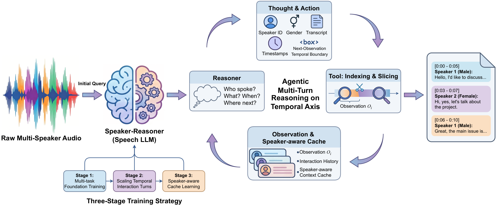

<h1 align="center">Speaker-Reasoner: Scaling Interaction Turns and Reasoning Patterns for Timestamped Speaker-Attributed ASR</h1>

<div align="center">

<div style="text-align: center;">
  
  
  <a href="https://arxiv.org/abs/2604.03074">
    
  </a>
  <a href="https://github.com/ASLP-lab/Speaker-Reasoner">
    
  </a>
  <a href="http://www.npu-aslp.org/">
    
  </a>
</div>

</div>

<div align="center">
  <h3>
    Zhennan Lin<sup>1</sup>, Shuai Wang<sup>2</sup>, Zhaokai Sun<sup>1</sup>, Pengyuan Xie<sup>3</sup>, Chuan Xie<sup>3</sup>, Jie Liu<sup>3</sup>, Qiang Zhang<sup>3</sup>, Lei Xie<sup>1†</sup>
  </h3>

  <p>
    <sup>†</sup>Corresponding author
  </p>

  <p>
    <sup>1</sup>Audio, Speech and Language Processing Group (ASLP@NPU), Northwestern Polytechnical University<br>
    <sup>2</sup>School of Intelligence Science and Technology, Nanjing University<br>
    <sup>3</sup>Shanghai Lingguang Zhaxian Technology
  </p>
</div>

----

Speaker-Reasoner is an end-to-end Speech LLM for **timestamped speaker-attributed ASR** featuring agentic multi-turn temporal reasoning. Instead of single-pass inference, the model iteratively analyzes global audio structure, autonomously predicts temporal boundaries, and performs fine-grained segment analysis, jointly modeling speaker identity, gender, timestamps, and transcription. A speaker-aware cache further extends processing to audio exceeding the training context window.



## 🌟 Highlights

- **Agentic multi-turn reasoning**: iterative global-to-local inference along the temporal axis — global speaker summary → boundary prediction → fine-grained segment decoding
- **Speaker-aware context cache**: extends processing to long-form audio beyond the training context window while preserving speaker consistency across chunks
- **Three-stage progressive training**: multi-task foundation → temporal interaction learning → cache-conditioned decoding
- **State-of-the-art performance**: outperforms strong baselines including closed-source Gemini-2.5-Pro on AliMeeting and AISHELL-4

## 📊 Results

### Segmented Evaluation (40–50s segments)

<table>
  <thead>
    <tr>
      <th rowspan="2">Model</th>
      <th colspan="4" align="center">AISHELL4-Eval</th>
      <th colspan="4" align="center">Alimeeting-Far</th>
    </tr>
    <tr>
      <th>DER↓</th><th>CER↓</th><th>cpCER↓</th><th>∆cp↓</th>
      <th>DER↓</th><th>CER↓</th><th>cpCER↓</th><th>∆cp↓</th>
    </tr>
  </thead>
  <tbody>
    <tr><td colspan="9"><b>Cascade Baselines</b></td></tr>
    <tr><td>Pyannote3.1 + Paraformer</td><td>8.10</td><td>19.18</td><td>26.24</td><td>7.06</td><td>19.13</td><td>30.15</td><td>45.39</td><td>15.24</td></tr>
    <tr><td colspan="9"><b>End-to-End Baselines</b></td></tr>
    <tr><td>Gemini-2.5-Pro†</td><td>36.07</td><td>19.81</td><td>25.11</td><td>5.30</td><td>56.39</td><td>30.16</td><td>39.29</td><td>9.13</td></tr>
    <tr><td>Qwen3-Omni-30B-A3B-Instruct</td><td>32.42</td><td>14.46</td><td>22.22</td><td>7.76</td><td>37.15</td><td>25.40</td><td>36.28</td><td>10.88</td></tr>
    <tr><td>Qwen2.5-Omni-7B</td><td>85.68</td><td>33.37</td><td>60.45</td><td>27.08</td><td>91.77</td><td>38.13</td><td>73.38</td><td>35.25</td></tr>
    <tr><td>SpeakerLM (212.25h)</td><td>–</td><td>17.75</td><td>26.14</td><td>8.39</td><td>–</td><td>18.63</td><td>32.22</td><td>13.59</td></tr>
    <tr><td>SpeakerLM (7638.95h)</td><td>–</td><td>17.17</td><td>18.37</td><td>1.20</td><td>–</td><td>13.97</td><td>16.05</td><td>2.08</td></tr>
    <tr><td>VibeVoice-ASR</td><td>10.88</td><td>22.30</td><td>26.30</td><td>4.00</td><td>20.70</td><td>34.67</td><td>40.54</td><td>5.87</td></tr>
    <tr><td>TagSpeech-Alimeeting</td><td>37.51</td><td>35.70</td><td>53.44</td><td>17.74</td><td>52.46</td><td>47.11</td><td>68.74</td><td>21.63</td></tr>
    <tr><td colspan="9"><b>Ours</b></td></tr>
    <tr><td>Qwen3-Omni + SOT sft (Stage 1)</td><td>–</td><td>17.65</td><td>19.59</td><td>1.94</td><td>–</td><td>24.24</td><td>26.03</td><td>1.79</td></tr>
    <tr><td>Speaker-Reasoner Base (Stage 1)</td><td>6.24</td><td>14.04</td><td>16.54</td><td>2.50</td><td>8.96</td><td>21.16</td><td>22.64</td><td>1.48</td></tr>
    <tr><td>Speaker-Reasoner Multi-turn (Stage 2)</td><td>5.19</td><td>13.83</td><td>14.93</td><td>1.10</td><td>7.47</td><td>20.34</td><td>20.29</td><td>−0.05</td></tr>
    <tr><td><b>Speaker-Reasoner Multi-turn w/ SAC (Stage 3)</b></td><td><b>5.26</b></td><td><b>13.83</b></td><td><b>14.73</b></td><td><b>0.90</b></td><td><b>7.34</b></td><td><b>20.57</b></td><td><b>20.43</b></td><td><b>−0.14</b></td></tr>
    <tr><td>Speaker-Reasoner Base 7B</td><td>12.00</td><td>15.65</td><td>25.60</td><td>9.95</td><td>18.43</td><td>24.97</td><td>38.12</td><td>13.15</td></tr>
    <tr><td>Speaker-Reasoner Multi-turn 7B</td><td>9.38</td><td>15.31</td><td>22.91</td><td>7.60</td><td>15.56</td><td>24.33</td><td>34.81</td><td>10.48</td></tr>
  </tbody>
</table>

† Closed-source model. DER unavailable for SpeakerLM and SOT-based models due to incompatible output formats.

### Long-form Evaluation (without segmentation)

| Model | AISHELL4-Eval DER↓ | AISHELL4-Eval cpCER↓ |
|---|---|---|
| Gemini-2.5-Pro | 15.32 | 31.59 |
| Speaker-Reasoner Multi-turn w/ SAC | 21.60 | 36.20 |

### Speaker Attribute Evaluation (AISHELL4-Eval)

| Model | Gender ACC↑ | Speaker Count ACC (SCA)↑ |
|---|---|---|
| Gemini-2.5-Pro | 94.80 | 67.03 |
| Qwen3-Omni-30B-A3B-Instruct | 97.12 | 60.49 |
| Speaker-Reasoner Multi-turn | **96.80** | **69.03** |

## Installation

### Environment Setup

```bash
git clone https://github.com/ASLP-lab/Speaker-Reasoner.git
cd Speaker-Reasoner

conda create -n speaker-reasoner python=3.10 -y
conda activate speaker-reasoner
```

Install MS-Swift and dependencies:

```bash
pip install ms-swift
```

## Model Download

Coming soon.

## Training

Coming soon.

## Inference

Coming soon.

## Citation

If you find this work useful, please cite:

```bibtex
@article{lin2026speakerreasoner,
  title={Speaker-Reasoner: Scaling Interaction Turns and Reasoning Patterns for Timestamped Speaker-Attributed ASR}, 
  author={Zhennan Lin and Shuai Wang and Zhaokai Sun and Pengyuan Xie and Chuan Xie and Jie Liu and Qiang Zhang and Lei Xie},
  year={2026},
  eprint={2604.03074},
  archivePrefix={arXiv},
  primaryClass={eess.AS},
  url={https://arxiv.org/abs/2604.03074}, 
}
```

## License

The code in this repository is released under the **Apache 2.0 License**.

## Contact

- **Issues**: Please open a GitHub Issue for bug reports or suggestions.
- **Email**: znlin@mail.nwpu.edu.cn, lxie@nwpu.edu.cn

<p align="center">
    <a href="http://www.nwpu-aslp.org/">
        
    </a>
</p>
